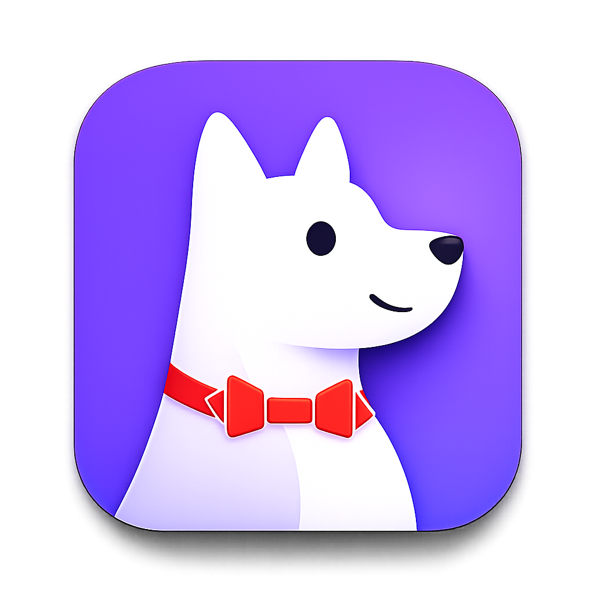

# Bark Notify Skill

[English README](README.md)

供各类 Agent 发送 [Bark](https://github.com/Finb/Bark) 推送通知的技能。

本仓库首先是一个技能；通知工具位于 `scripts/bark-notify.py`，不需要从 PyPI 单独安装包。

> ⭐ 如果这个 Skill 对你有帮助，请为[本仓库点一个 Star](https://github.com/Lumen01/agent-bark-notify)。你的支持能让更多人发现这个项目，也会鼓励项目持续改进。

## 安装技能

### 让 Agent 执行安装

将下面这段 Prompt 交给有终端权限的 Agent：

```text
请阅读 https://github.com/Lumen01/agent-bark-notify/blob/main/README.md，并按照其中“Install Manually”章节安装 Bark Notify Skill。除非我明确要求仅给单一运行时安装，否则优先采用多 Agent 共享安装方式。修改前检查是否已经安装；将技能暴露给我指定的运行时，并确认其能够发现 SKILL.md。不要配置、输出、提交 Bark device key，也不要把它写入 shell history。
```

### 手工安装

以下说明面向希望自行安装技能的使用者。

#### 多 Agent 共用

如果希望 Codex、Claude、OpenCode 等多个 Agent 共用此技能，只需在 `~/.agents` 下安装一次：

```bash
git clone https://github.com/Lumen01/agent-bark-notify.git ~/.agents/skills/bark-notify
```

如果运行时有自己的技能目录，再将它指向这份共享副本。

#### 仅供单个 Agent 使用

如果只给一个 Agent 使用，请安装或链接到该 Agent 的技能目录。例如：

```bash
mkdir -p ~/.codex/skills
ln -sf ~/.agents/skills/bark-notify ~/.codex/skills/bark-notify

mkdir -p ~/.claude/skills
ln -sf ~/.agents/skills/bark-notify ~/.claude/skills/bark-notify
```

OpenCode 或其他 Agent 请使用其文档中约定的等价技能目录。唯一要求是技能根目录包含 `SKILL.md`。

## 让 Agent 主动使用

安装技能只会让它变为可用。若希望 Agent 主动发送进度通知，请按作用范围在全局或项目级 `AGENTS.md` 中加入：

```markdown
- Use the bark-notify SKILL to update the user on progress, especially when handling time-consuming tasks.
```

希望多个项目都使用时，请放在全局 `AGENTS.md`；只针对当前仓库时，请放在项目级 `AGENTS.md`。

## 配置凭据

请将 Bark 凭据保存在本机私有位置，绝不能提交真实 Key。

推荐手动创建 `~/.config/bark-notify.env`，这样 Key 不会出现在命令或 shell history 中：

```env
BARK_SERVER="https://api.day.app"
BARK_KEY="your-bark-device-key"
BARK_GROUP="Agents"
```

也可以通过标准输入安全初始化：

```bash
read -rs BARK_KEY; printf '\n'
printf '%s\n' "$BARK_KEY" | python3 ~/.agents/skills/bark-notify/scripts/bark-notify.py --save-config --key-stdin
unset BARK_KEY
```

## Agent 身份

Agent 的分组和图标元数据可存放在 `~/.config/bark-notify-agents.json`：



```json
{
  "codex": {
    "group": "Codex",
    "icon": "https://example.com/icons/codex.png"
  }
}
```

图标必须能被接收通知的 iOS 设备访问。可使用 GitHub Pages、Cloudflare Pages、S3/R2、nginx、Caddy 或 jsDelivr 托管。如果没有传入 `--icon`，Agent 配置或环境变量里也没有图标，技能会通过公开的 jsDelivr URL 使用上面的 Agent Bark 图标。优先级依次为显式 `--icon`、Agent 配置或环境变量、内置默认图标。

环境变量的优先级高于 Agent JSON：

```env
BARK_AGENT_CODEX_GROUP="Codex"
BARK_AGENT_CODEX_ICON="https://example.com/icons/codex.png"
```

## Agent 使用方式

技能安装后，Agent 应读取 `SKILL.md`，并以技能目录为相对路径运行脚本：

```bash
python3 scripts/bark-notify.py "Title" "Body"
python3 scripts/bark-notify.py --agent codex --level active "Build finished" "Codex completed the requested task"
python3 scripts/bark-notify.py --agent codex --level passive "Progress update" "Tests are running"
python3 scripts/bark-notify.py --ping
python3 scripts/bark-notify.py --doctor
python3 scripts/bark-notify.py --dry-run --agent codex --level active "Build finished" "Ready"
```

## 通知等级

技能使用 Bark 的通知中断等级：

| 场景 | 等级 |
| --- | --- |
| 进度更新、后台状态、仅供参考的信息 | `passive` |
| 用户交办任务完成，或用户明确要求普通提醒 | `active` |
| Agent 被阻塞，需要用户尽快决定 | `timeSensitive` |
| 部署失败、服务不可用、长任务崩溃 | `timeSensitive` |
| 用户明确要求紧急/严重告警 | `critical` |

`passive` 只会进入通知中心，不点亮屏幕。`active` 是 Bark 的正常可见通知，应在用户交办的任务完成时使用。启用相应权限后，`timeSensitive` 可在专注模式中显示。`critical` 可忽略静音和专注模式，只应在真实事故或用户明确要求紧急通知时使用。

iOS 上需为 Bark 开启对应通知权限：

- 打开 iOS“设置”→“通知”→“Bark”。
- 启用 Bark 通知。
- 若希望 `timeSensitive` 穿透专注模式，启用“时效性通知”。
- 若 Bark 提供该选项且确有需要，启用“关键通知”。
- 专注模式仍可能影响即时显示；请在相关专注模式中允许 Bark。

如果需要 shell 命令，可选地创建本地包装器：

```bash
mkdir -p ~/.local/bin
ln -sf ~/.agents/skills/bark-notify/scripts/bark-notify.py ~/.local/bin/bark-notify
```

## 发送前诊断

当 Agent、图标、分组或服务器行为不符合预期时，使用 `--doctor`。它会输出解析后的配置并 ping Bark，但不会暴露 device key。使用 `--dry-run` 可查看最终推送 payload 而不实际发送；其中 device key 始终显示为 `***`。

## 自动发布到 ClawHub

`.github/workflows/clawhub-publish.yml` 会在相关文件推送到 `main` 时自动发布本技能。它使用 ClawHub 官方可复用工作流：未变更内容会被跳过；技能有变更时会自动发布下一个 patch 版本。

首次运行前，请添加名为 `CLAWHUB_TOKEN` 的仓库 Actions Secret：

1. 以该技能所有者身份登录 ClawHub，在网页中创建 ClawHub API token。
2. 在 GitHub 仓库打开 **Settings → Secrets and variables → Actions**，新建名为 `CLAWHUB_TOKEN` 的 Secret，并填入该 token。
3. 在 Actions 页面手动运行一次 **Publish Bark Notify to ClawHub**，或向 `main` 推送相关改动。

该 token 只会传给发布工作流，绝不能提交到仓库。

## 开发与测试

```bash
python3 -m unittest discover -s tests
python3 -m py_compile scripts/bark-notify.py tests/test_cli.py
```
